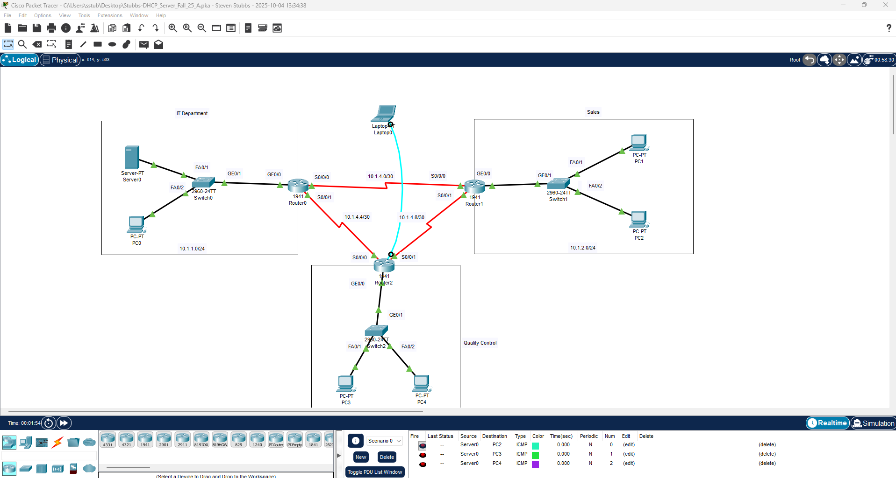
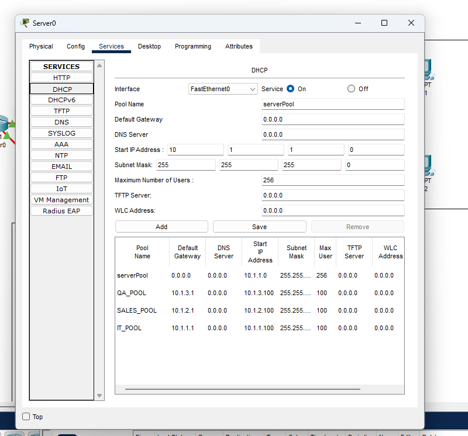
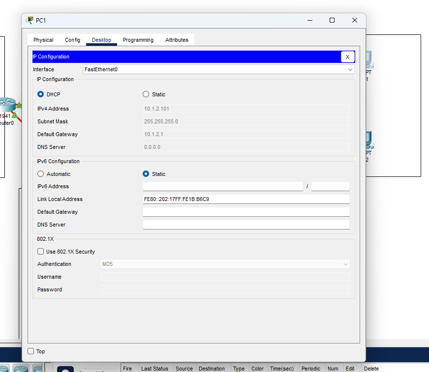
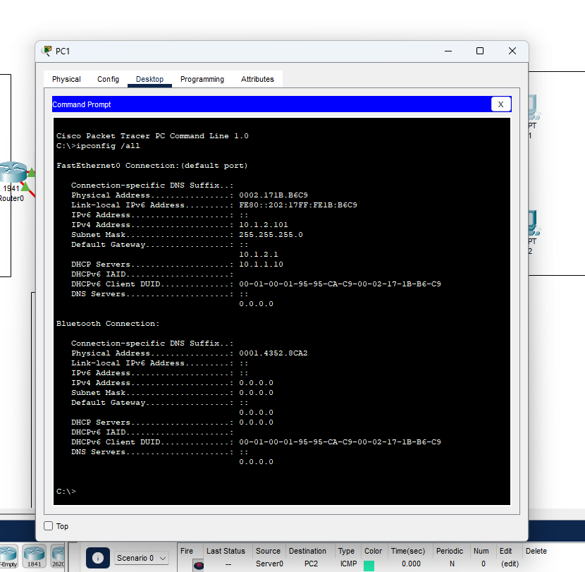
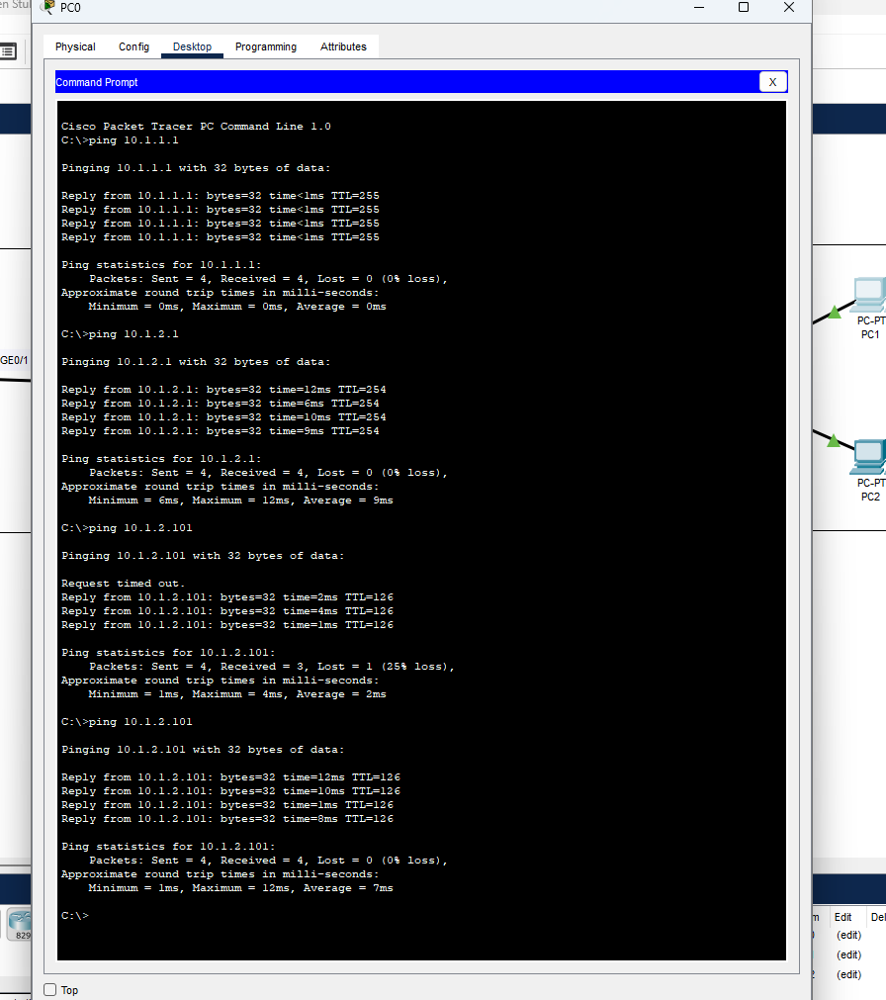

# DHCP Server Configuration Lab

This lab demonstrates how to configure a centralized DHCP server to automatically assign IPv4 addresses, subnet masks, default gateways, and DNS settings to client devices. DHCP is one of the most essential services in enterprise networks and is a critical foundation for network automation and cybersecurity monitoring.

---

## 🎯 Purpose

This lab teaches how to:

- Configure a DHCP server in a network
- Set up IP address pools (scopes)
- Define default gateways and DNS servers
- Exclude reserved IP addresses
- Verify DHCP address assignment to clients
- Demonstrate automatic host configuration vs. manual/static addressing

These skills directly apply to both networking and cybersecurity operations, including detecting rogue DHCP servers and troubleshooting addressing issues.

---

## 🗂 Topology

- **1 DHCP Server**
- **1 Switch**
- **Multiple PCs configured for DHCP**
- **Server providing:**
  - IP addressing via DHCP
  - Default gateway assignment
  - DNS server assignment



---

# ⚙️ Configuration Steps

## 1️⃣ Configure DHCP Server Pool

On the DHCP server → Services → DHCP:

1. Click **DHCP**
2. Select **Add Pool**
3. Enter:
   - **Pool Name:** LAN
   - **Default Gateway:** 192.168.1.1
   - **DNS Server:** 8.8.8.8
   - **Start IP Address:** 192.168.1.100
   - **Subnet Mask:** 255.255.255.0
   - **Maximum Users:** 50
4. Click **Save**



---

## 2️⃣ Exclude Reserved IP Addresses (if required)

These are typically used for:

- Routers
- Servers
- Printers
- Management addresses

Example:

```
Exclude: 192.168.1.1 – 192.168.1.50
```

(Not always mandatory for small Packet Tracer labs, but good practice.)

---

## 3️⃣ Configure PCs to Use DHCP

For each PC:

1. Desktop → IP Configuration
2. Select **DHCP**
3. Wait for the assigned IP address

Expected results:

```
IP Address: 192.168.1.x
Subnet Mask: 255.255.255.0
Default Gateway: 192.168.1.1
DNS Server: 8.8.8.8
```



---

## 4️⃣ Verify IP Address Assignment

On each PC:

- Confirm IP details under **IP Configuration**
- Use command prompt:

```
ipconfig /all
```



---

## 5️⃣ Test Client Connectivity

From any PC command prompt:

### Ping the default gateway:
```bash
ping 192.168.1.1
```

### Ping another DHCP client:
```bash
ping 192.168.1.x
```

### Ping a DNS server (if real-world simulation):
```bash
ping 8.8.8.8
```



---

# ✔ Summary

This lab demonstrated:

- How to configure a DHCP pool
- Assigning gateway and DNS values
- Automatic host IP assignment
- Basic connectivity testing
- The importance of DHCP in network operations

DHCP is a core service in every modern network and a key component in cybersecurity monitoring, where misconfigured or rogue DHCP servers often cause major outages or security issues.

---
