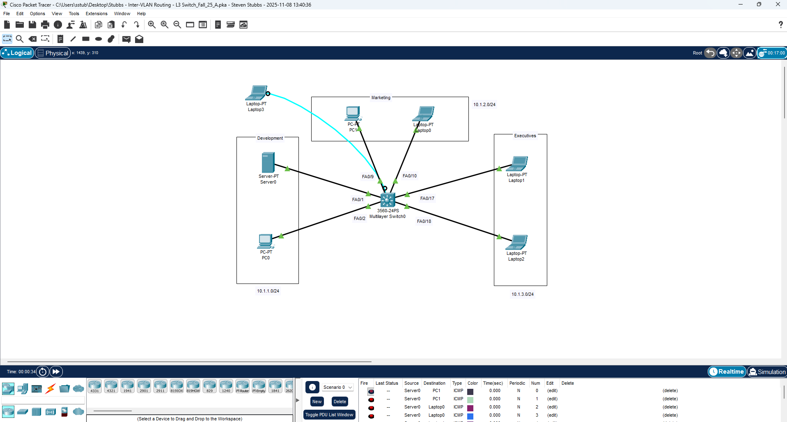
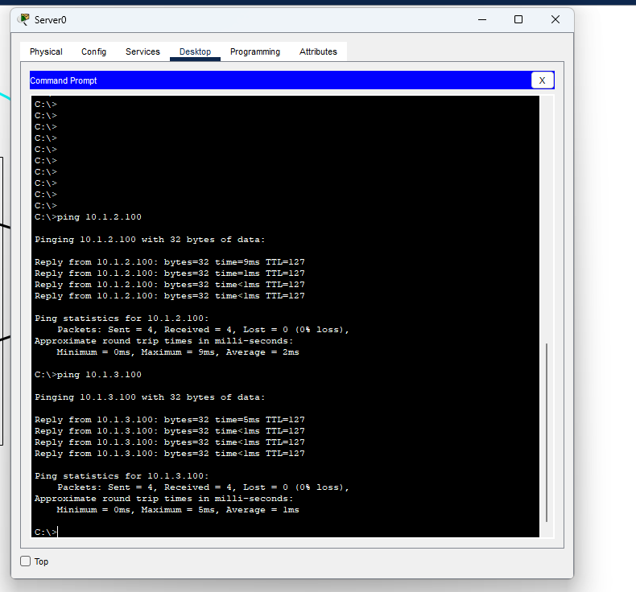

# Inter-VLAN Routing — Layer 3 Switch (SVIs)

This lab demonstrates Inter-VLAN Routing using a **Layer 3 Switch**. Instead of using a router or Router-on-a-Stick, the L3 switch performs routing internally using **SVIs (Switched Virtual Interfaces)**. This is the most modern, scalable method for routing between VLANs in enterprise networks.

---

## 🎯 Purpose

This lab teaches how to:

- Create VLANs  
- Assign ports to VLANs  
- Create SVIs (`interface vlan X`)  
- Assign IP addresses to SVIs  
- Enable Layer 3 routing on a switch (`ip routing`)  
- Verify VLANs, SVI status, and routing table  
- Test cross-VLAN connectivity  

Layer 3 switches provide extremely fast inter-VLAN routing and are commonly used in campus networks, data centers, and enterprise environments.

---

## 🗂 Topology

- **VLAN 10 – Development** → 10.1.1.0/24  
- **VLAN 20 – Marketing** → 10.1.2.0/24  
- **VLAN 30 – Executives** → 10.1.3.0/24  
- **SVI for VLAN 10** → 10.1.1.1  
- **SVI for VLAN 20** → 10.1.2.1  
- PCs connected via access ports  



---

# ⚙️ Configuration Steps

## 1️⃣ Create VLANs

```bash
Switch(config)# vlan 10
Switch(config-vlan)# name DEVELOPMENT
Switch(config-vlan)# exit

Switch(config)# vlan 20
Switch(config-vlan)# name MARKETING
Switch(config-vlan)# exit
```

---

## 2️⃣ Assign Access Ports to VLANs

### VLAN 10
```bash
Switch(config)# interface fa0/2
Switch(config-if)# switchport mode access
Switch(config-if)# switchport access vlan 10

Switch(config)# interface fa0/3
Switch(config-if)# switchport mode access
Switch(config-if)# switchport access vlan 10
```

### VLAN 20
```bash
Switch(config)# interface fa0/13
Switch(config-if)# switchport mode access
Switch(config-if)# switchport access vlan 20

Switch(config)# interface fa0/14
Switch(config-if)# switchport mode access
Switch(config-if)# switchport access vlan 20
```


---

## 3️⃣ Enable Layer 3 Routing on the Switch

```bash
Switch(config)# ip routing
```

This command allows the switch to act like a router and route between VLANs.

---

## 4️⃣ Create SVIs for Each VLAN

### SVI for VLAN 10
```bash
Switch(config)# interface vlan 10
Switch(config-if)# ip address 10.1.1.1 255.255.255.0
Switch(config-if)# no shutdown
```

### SVI for VLAN 20
```bash
Switch(config)# interface vlan 20
Switch(config-if)# ip address 10.1.2.1 255.255.255.0
Switch(config-if)# no shutdown
```


---

## 5️⃣ Configure PC IP Addresses

### VLAN 10 PCs  
```
IP: 10.1.1.x  
Mask: 255.255.255.0  
Gateway: 10.1.1.1  
```

### VLAN 20 PCs  
```
IP: 10.1.2.x  
Mask: 255.255.255.0  
Gateway: 10.1.2.1  
```

---

## 6️⃣ Verify Layer 3 Routing

### Check routing table:

```bash
Switch# show ip route
```

Expected:
```
C    10.1.1.0/24 is directly connected, Vlan10
C    10.1.2.0/24 is directly connected, Vlan20
C    10.1.3.0/24 is directly connected, Vlan30
```

---

## 7️⃣ Inter-VLAN Connectivity Test

### From VLAN 10 PC → VLAN 20 PC  
ping 10.1.2.100

### From VLAN 10 PC → VLAN 30 PC  
ping 10.1.3.100
```



---

## ✔ Summary

This lab demonstrated:

- Creating VLANs  
- Assigning access ports  
- Enabling `ip routing`  
- Configuring SVIs for each VLAN  
- Allowing the Layer 3 switch to route between VLANs  
- Verifying the routing table  
- Successful ping between VLAN 10 and VLAN 20  

Layer 3 switch routing is the fastest and most scalable method for inter-VLAN routing and is widely used in modern enterprise networks.

---
