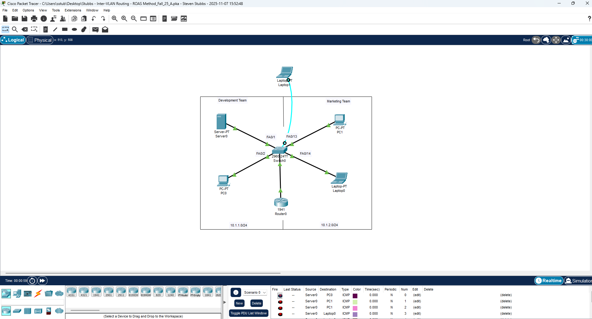
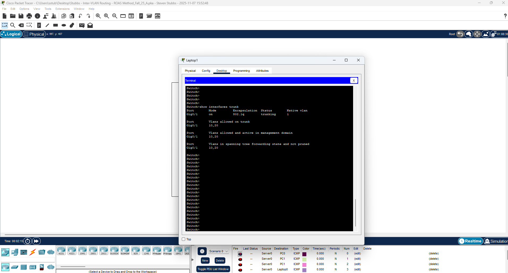
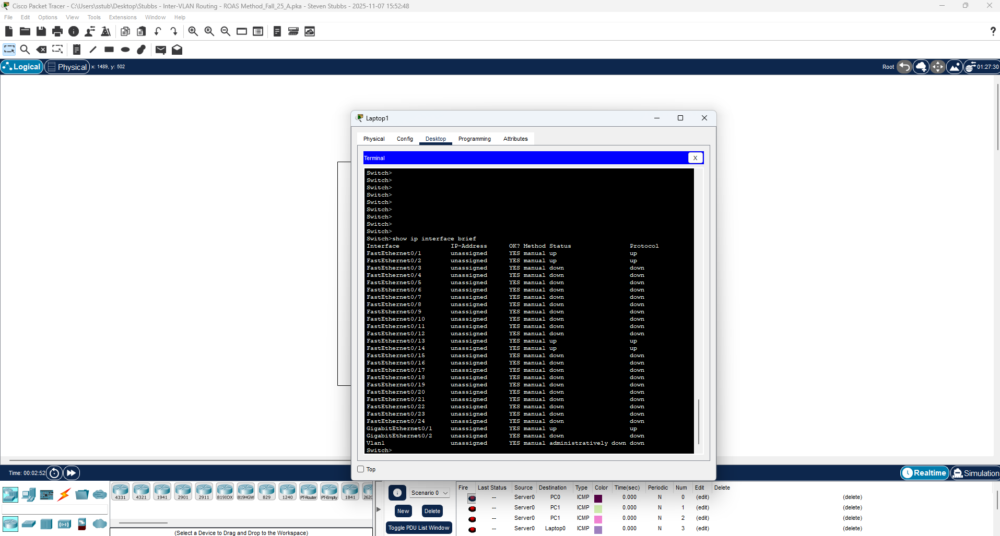

# Inter-VLAN Routing — Router-on-a-Stick (ROAS)

This lab demonstrates the Router-on-a-Stick (ROAS) method of inter-VLAN routing, where a single router interface is divided into multiple subinterfaces—one per VLAN. The switch–router link is configured as a trunk, carrying 802.1Q tagged traffic for VLAN 10 and VLAN 20. ROAS is more efficient than the pure legacy method because it does not require multiple physical router interfaces.

---

## 🎯 Purpose

This lab demonstrates how to:

- Create VLANs  
- Assign switchports to the correct VLAN  
- Configure a trunk port on the switch  
- Configure router subinterfaces for each VLAN  
- Assign default gateways  
- Verify trunking, VLANs, and subinterfaces  
- Test inter-VLAN connectivity via ROAS  

---

## 🗂 Topology

- VLAN 10 → 10.1.10.0/24  
- VLAN 20 → 10.1.20.0/24  
- One physical router interface (G0/0), split into:  
  - G0/0.10 (VLAN 10)  
  - G0/0.20 (VLAN 20)  
- Switch port F0/24 configured as a trunk  
- PCs assigned to VLANs via access ports  



---

# ⚙️ Configuration Steps

## 1️⃣ Create VLANs

```bash
Switch(config)# vlan 10
Switch(config-vlan)# name DEVELOPMENT
Switch(config-vlan)# exit

Switch(config)# vlan 20
Switch(config-vlan)# name MARKETING
Switch(config-vlan)# exit
```

---

## 2️⃣ Assign Access Ports to VLANs

### VLAN 10  
```bash
Switch(config)# interface fa0/2
Switch(config-if)# switchport mode access
Switch(config-if)# switchport access vlan 10

Switch(config)# interface fa0/3
Switch(config-if)# switchport mode access
Switch(config-if)# switchport access vlan 10
```

### VLAN 20  
```bash
Switch(config)# interface fa0/13
Switch(config-if)# switchport mode access
Switch(config-if)# switchport access vlan 20

Switch(config)# interface fa0/14
Switch(config-if)# switchport mode access
Switch(config-if)# switchport access vlan 20
```

---

## 3️⃣ Configure the Switch Trunk Port

```bash
Switch(config)# interface fa0/24
Switch(config-if)# switchport mode trunk
Switch(config-if)# switchport trunk encapsulation dot1q
Switch(config-if)# switchport trunk allowed vlan 10,20
```



---

## 4️⃣ Configure Router-on-a-Stick Subinterfaces

### Enable Router Interface

```bash
Router(config)# interface g0/0
Router(config-if)# no shutdown
```

### Subinterface for VLAN 10

```bash
Router(config)# interface g0/0.10
Router(config-subif)# encapsulation dot1Q 10
Router(config-subif)# ip address 10.1.10.1 255.255.255.0
```

### Subinterface for VLAN 20

```bash
Router(config)# interface g0/0.20
Router(config-subif)# encapsulation dot1Q 20
Router(config-subif)# ip address 10.1.20.1 255.255.255.0
```



---

## 5️⃣ Set Default Gateways (PCs)

### VLAN 10 PCs  
```
Gateway: 10.1.10.1
```

### VLAN 20 PCs  
```
Gateway: 10.1.20.1
```

---

# 🔍 Verification

## Verify VLANs  
```bash
Switch# show vlan brief
```


---

## Verify Trunk  
```bash
Switch# show interfaces trunk
```

---

## Verify Subinterfaces  
```bash
Router# show ip interface brief
```

Expected to show:

```
Gig0/0.10   up   up  
Gig0/0.20   up   up
```

---

# 📡 Inter-VLAN Ping Tests

### From VLAN 10 → VLAN 20  
```bash
PC> ping 10.1.20.10
```

### From VLAN 20 → VLAN 10  
```bash
PC> ping 10.1.10.10
```


---

## ✔ Summary

This ROAS lab demonstrated:

- VLAN creation  
- Access port configuration  
- Trunk port configuration  
- Router subinterfaces with 802.1Q tagging  
- Default gateway assignments  
- Successful inter-VLAN communication  

ROAS is a critical networking concept used widely in real networks and is foundational for Network+ and CCNA studies.

---

## 📎 Files in This Lab

```
Inter-VLAN-ROAS/
│
├── README.md
├── Stubbs - Inter-VLAN Routing - ROAS Method_Fall_25_A.pka
└── Screenshots/
      ROAS_Topology.png
      ROAS_VLAN_Brief.png
      ROAS_Trunk.png
      ROAS_Subinterfaces.png
      ROAS_Ping_Tests.png
```
